

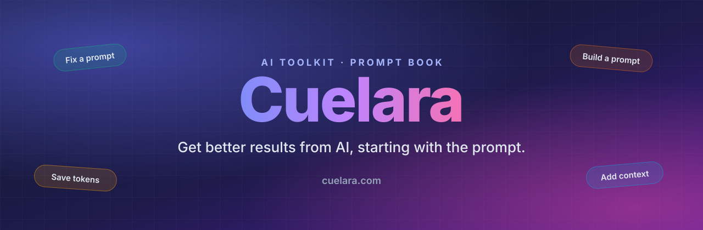

 

**An AI toolkit and prompt book that helps people get better results from AI.**
 
Designed, built and run end to end by one person: the product, the tools, the extension, the admin and the data.

 

---

> ### Professors and reviewers: want to read the code?
> The full source is available to academic reviewers. Send a short email with your GitHub username and I will add you as a collaborator with read access.
>
> 

---

## In one minute

AI tools are only as good as the instructions they are given, and most people were never taught how to write them. The result is generic answers, wasted money and a lot of trial and error.

**Cuelara starts from the problem the person actually has**, in their own words, and puts the right tool in front of them. It is not one tool. It is a growing toolkit, a library of ready-made prompts, a browser extension and an API, behind one guided experience.

## The problems it solves

| What people say | What is really wrong | How Cuelara helps |
| --- | --- | --- |
| "The AI keeps giving me generic answers." | The prompt is vague or missing key details. | **Optimizer** rewrites it. **Score** shows what is weak. |
| "It ignores half of what I asked." | Instructions conflict or are ambiguous. | **Debugger** finds each flaw and how to fix it. |
| "I do not know how to ask for this." | A blank page is hard. | **Builder** and the **Prompt book** start you off. |
| "My prompts are long and expensive." | Wording is padded and repeats itself. | **Token Optimizer** shortens it. **Diff & Cost** proves the saving. |
| "My document is too big to paste." | Whole files waste tokens and cause mistakes. | **Context Extractor** pulls out just the relevant parts. |
| "I want something that looks like that website." | Design is hard to put into words. | **Site to Prompt** measures the real page and writes the prompt. |
| "I do not know which tool I need." | Too many options, no guidance. | **Guided start** matches your problem to the right tool. |

## The whole platform at a glance

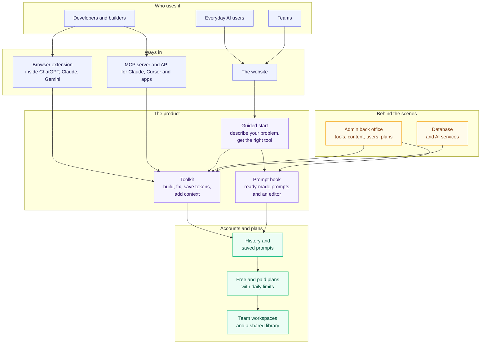

Light boxes are what visitors touch, purple is the guided and AI-powered core, green is what an account adds, amber is what runs behind the scenes.

## How a visit starts

A visitor types their problem, or picks a common situation. If they type, Cuelara uses **text embeddings** to match the meaning of their words to the right tool and to any ready-made prompts that fit. If they pick a situation, they go straight to the tools for it.

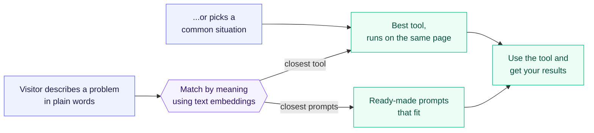

**Under the hood:** every tool description and every prompt in the book is turned into a meaning fingerprint (an embedding) once. The visitor's sentence gets one on request and the closest meaning wins, so nothing depends on exact keywords.

---

## The toolkit, tool by tool

Each tool is shown the same way: the pain it removes, the journey from input to result, and a line on how it works inside. The set of tools keeps growing; these are the current ones.

### 1. Prompt Builder

> **The pain:** You know what you want from the AI, but not how to ask for it, so you stare at an empty box.

**What you get:** Describe the idea in plain words and get a complete, structured prompt, written the way your chosen AI likes to be asked. &nbsp;[Try it live ↗](https://cuelara.com/tools/prompt-builder)

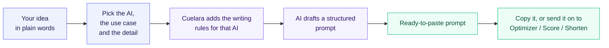

**Under the hood:** each target AI has its own guidance: Claude gets XML-tagged sections, ChatGPT gets Markdown with numbered steps, coding editors get scope and acceptance criteria. Use cases (coding, writing, marketing, business, research) change which sections are included.

### 2. Prompt Template Generator

> **The pain:** A blank page is slow, and a template full of blanks is easy to leave half-filled.

**What you get:** Pick a ready-made prompt, fill in the highlighted blanks, add your own points, and copy a finished prompt in seconds. &nbsp;[Try it live ↗](https://cuelara.com/prompt-template-generator)

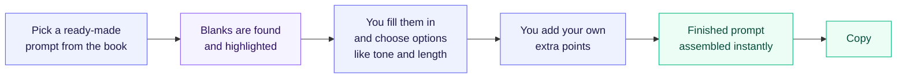

**Under the hood:** no AI call is involved: placeholders written as [WORDS IN CAPITALS] are detected by rules, and your choices are appended as a short requirements block. It is instant, free and works offline.

### 3. Site to Prompt

> **The pain:** You love how a website looks but cannot describe its design well enough for an AI to recreate it.

**What you get:** A design prompt that captures the real colours, fonts, spacing and layout, ready for tools like v0, Bolt, Claude or Midjourney. &nbsp;[Try it live ↗](https://cuelara.com/tools/site-to-prompt)

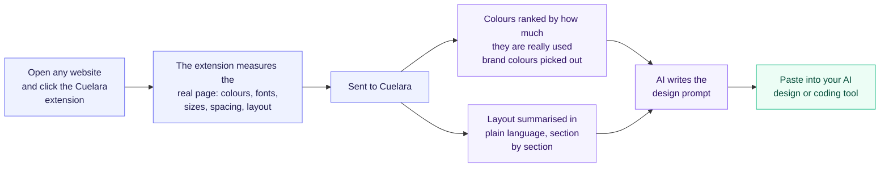

**Under the hood:** measuring happens in your own browser, so it sees the page as you see it, including pages behind a login. Colour and layout facts are computed by rules first, which keeps the AI step short, cheap and consistent.

### 4. Context Extractor

> **The pain:** Your document is too big to paste into the AI, and pasting all of it is expensive and invites made-up answers.

**What you get:** Upload a document, ask a question, and get only the passages that matter, ready to paste, with the tokens you saved. &nbsp;[Try it live ↗](https://cuelara.com/tools/context-extractor)

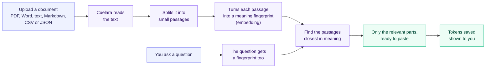

**Under the hood:** this is retrieval by meaning, not keyword search, so a question can find a passage that uses different words. Uploaded documents expire automatically and are cleaned up on later uploads.

### 5. Prompt Optimizer

> **The pain:** Your prompt is vague or messy, so the AI answers generically or off-target.

**What you get:** A rewritten prompt with a clear role, steps, constraints and an output format, streamed to you as it is written. &nbsp;[Try it live ↗](https://cuelara.com/tools/prompt-optimizer)

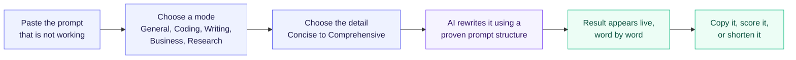

**Under the hood:** each mode carries a hand-written example of a strong prompt in that field. They set the quality bar, but the AI writes a fresh prompt for your input instead of filling in a form.

### 6. Prompt Debugger

> **The pain:** The AI ignores part of your instructions, contradicts itself or behaves differently each time, and you cannot see why.

**What you get:** A report of what is wrong, how serious it is and exactly how to fix it, plus the checks your prompt already passes. &nbsp;[Try it live ↗](https://cuelara.com/tools/prompt-debugger)

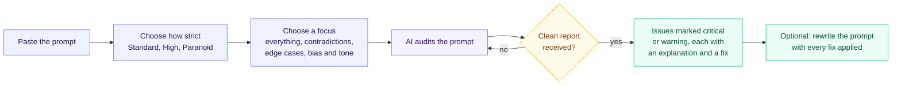

**Under the hood:** the audit must come back as a structured report; if it does not, it is asked again with a sharper reminder. The same engine also powers the public API.

### 7. Prompt Formatter

> **The pain:** Your prompt is one long wall of text that is hard to read, hard to edit and easy for the AI to misread.

**What you get:** The same prompt, organised into clear labelled sections in the format your AI prefers. &nbsp;[Try it live ↗](https://cuelara.com/tools/prompt-formatter)

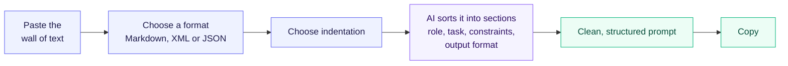

**Under the hood:** XML suits Claude, Markdown suits most chat models, and JSON suits API use. Each format has its own strict output rules, so you do not get a mix of styles.

### 8. Intelligence Score

> **The pain:** You cannot tell if your prompt is any good until you have already sent it and been disappointed.

**What you get:** A 0 to 100 score for how clear, precise and efficient your prompt is, with a prioritised list of what to improve. &nbsp;[Try it live ↗](https://cuelara.com/tools/intelligence-score)

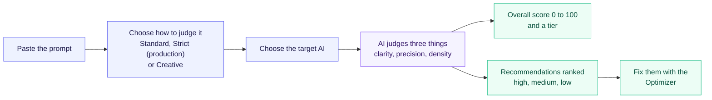

**Under the hood:** the same prompt can score differently under different criteria on purpose: a production pipeline needs strict output rules, while a creative brief should not be penalised for lacking them.

### 9. Token Optimizer

> **The pain:** Long prompts cost money on every call and can hit the AI's length limit.

**What you get:** A shorter prompt that keeps every instruction, with the real before-and-after token counts. &nbsp;[Try it live ↗](https://cuelara.com/tools/token-optimizer)

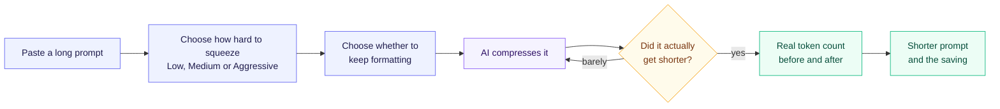

**Under the hood:** levels aim for roughly 15 to 25 percent (Low), 35 to 45 percent (Medium) and 50 percent or more (Aggressive). Savings are measured with real token counting, not estimated, and one automatic retry happens if the first pass barely shrinks the prompt. The same engine is used by the MCP server.

### 10. Diff & Cost Estimate

> **The pain:** You rewrote a prompt but cannot see exactly what changed, or whether it really got cheaper.

**What you get:** A side-by-side comparison of two versions with the token difference and what each costs on popular AI models. &nbsp;[Try it live ↗](https://cuelara.com/tools/compare-estimate)

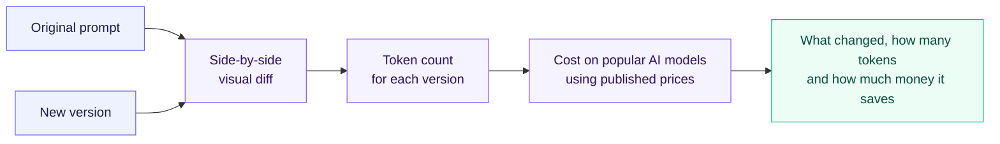

**Under the hood:** prices come from each provider's published rates, kept in one table with the date they were last checked, so estimates stay honest and easy to update.

---

## The prompt book

**The pain:** people want a starting point, not a lecture on prompt writing.

A library of ready-made prompts for everyday jobs, each with a worked example. Visitors browse by category or search, open a prompt, press **Edit this prompt**, fill in the blanks and copy a finished version.

```mermaid
flowchart LR
    A["Browse by category,<br/>search, or arrive from<br/>the guided start"]:::in --> B["Open a prompt<br/>with a worked example"]:::in
    B --> C["Edit this prompt:<br/>fill in the blanks"]:::in
    C --> D["Finished prompt"]:::out
    D --> E["Copy it, or open it in<br/>the Template Generator"]:::out
    F["Admin adds or edits prompts"]:::warn --> G["Meaning fingerprint<br/>refreshed automatically"]:::ai
    G --> A
    classDef in fill:#eef2ff,stroke:#6366f1,color:#1e1b4b
    classDef ai fill:#f5f3ff,stroke:#8b5cf6,color:#2e1065
    classDef out fill:#ecfdf5,stroke:#10b981,color:#064e3b
    classDef warn fill:#fffbeb,stroke:#f59e0b,color:#78350f
```

**Under the hood:** the library has its own keyword search, and each published prompt also carries a meaning fingerprint so the guided start can recommend it.

## The browser extension

**The pain:** switching tabs to improve a prompt breaks your flow.

A small button appears in the chat box on ChatGPT, Claude, Gemini and other AI sites. Pick a tool and the prompt is improved in place. The same extension powers **Site to Prompt**. Nothing is sent until the user chooses a tool, it works without an account, and it can be turned off for any site.

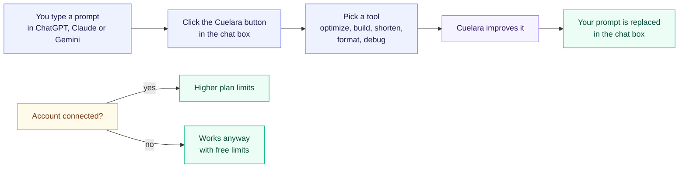

## For developers: MCP server and API

**The pain:** developers want these tools inside the AI apps and code they already use.

The same engines behind the web tools are available to **Claude, Cursor and other MCP clients**, and as a **REST API** for building, optimizing, debugging, formatting and compressing prompts.

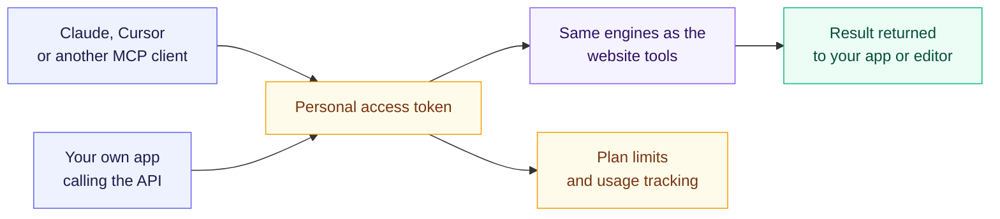

## Accounts, plans and teams

**The pain:** good prompts get lost in old chats, and teams keep rewriting the same ones.

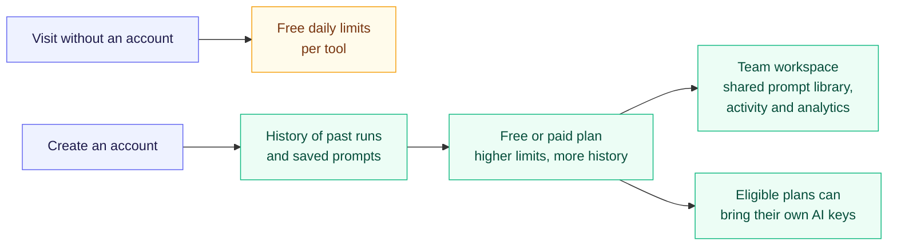

## Behind the scenes: the admin back office

What visitors see is kept fresh from a simple admin area, without waiting for a new release.

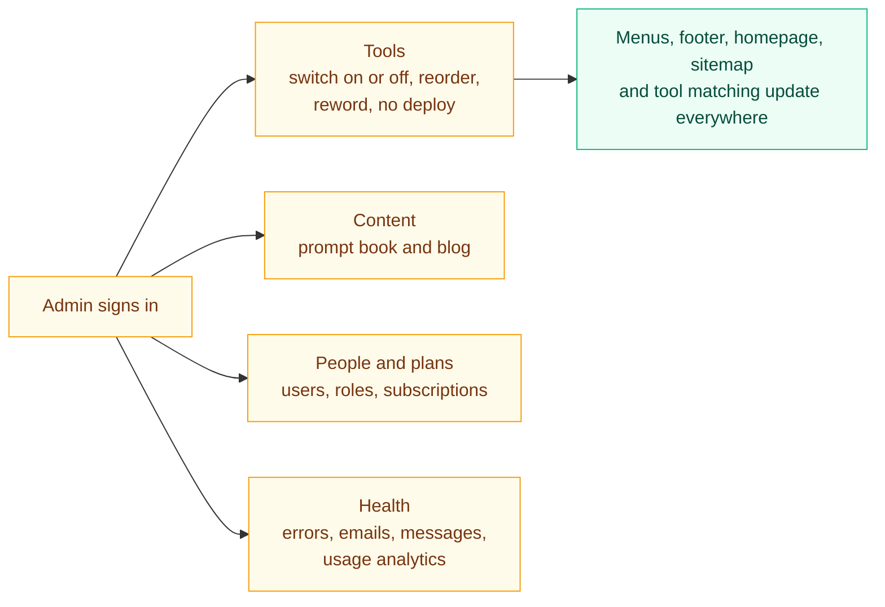

**Under the hood:** what a tool *is* (its page and behaviour) lives in code; what an admin may change (on or off, wording, order) lives in the database. If the database is unreachable the site falls back to safe defaults instead of an error page.

---

## What this project demonstrates

- **Product thinking:** a journey that starts from the user's problem instead of a list of features.
- **Applied AI:** meaning-based matching and retrieval, prompt design, real token accounting and cost-aware model use.
- **Full-stack delivery:** a public site, accounts and billing, an admin back office, a browser extension and an API, built and shipped by one person.
- **Data and operations:** careful, additive database changes on a live product, caching, and graceful failure.

---

**Aliyan Faisal**

© Aliyan Faisal. All rights reserved. This repository is an overview for viewing only. The Cuelara name, design and source code may not be copied, modified, redistributed or used without written permission.

