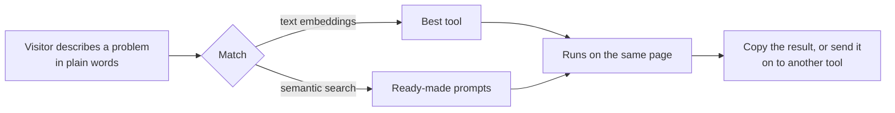
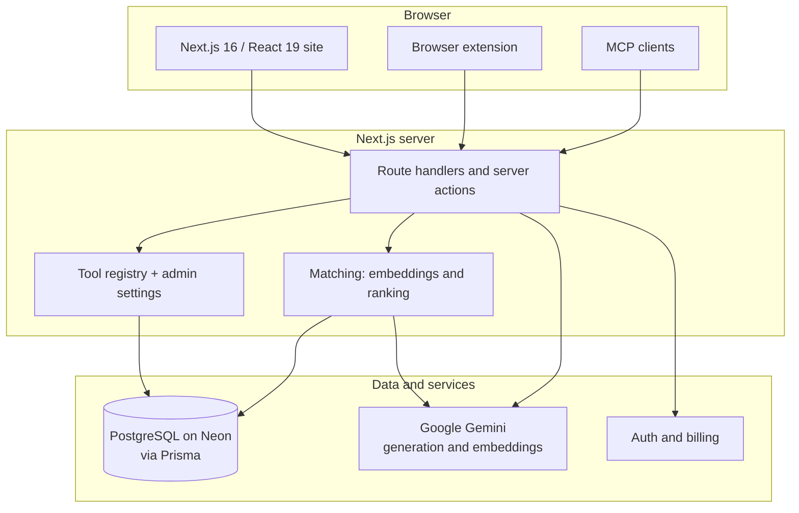

 

**A full-stack AI platform I designed, built and run on my own.**
 
A growing toolkit, a searchable prompt library, a browser extension and an MCP server, behind one guided experience.

 

---

> ### Professors and reviewers: want to read the code?
> The full source is available to academic reviewers. Send a short email with your GitHub username and I will add you as a collaborator with read access, usually within a day.
>
> 

---

## The idea

Most people get weak answers from AI because the prompt is weak, and they cannot tell what is wrong with it. Cuelara starts from the problem a person actually has, in their own words, and routes them to the right tool, which runs on the same page.

<table>
<tr>
<td width="25%" align="center"><h3>Fix</h3>Find out why a prompt fails and rewrite it</td>
<td width="25%" align="center"><h3>Build</h3>Turn a rough idea into a finished prompt</td>
<td width="25%" align="center"><h3>Save</h3>Cut tokens and cost without losing meaning</td>
<td width="25%" align="center"><h3>Add context</h3>Give the AI the right material to work from</td>
</tr>
</table>

## How a visit works

Nothing in the matching is hard-coded to keywords: each tool and each prompt is embedded once, the visitor's sentence is embedded on request, and the closest meaning wins.

## What is inside

| | | |
|:--|:--|:--|
| **Guided homepage flow** Ask, match, run, in three steps. | **Toolkit** Tools grouped by the job they do: build, fix, save, add context. It keeps growing. | **Prompt book** Searchable prompts with worked examples and a fill-in-the-blanks editor. |
| **Browser extension** Improve a prompt in place on ChatGPT, Claude, Gemini and more. | **MCP server** Use the toolkit from Claude, Cursor and other MCP clients. | **Admin back office** Users, plans, roles, content and per-tool on/off, order and wording, with no deploy. |

<b>See the current tools</b> (the list grows over time)

 

| Job | Tool | What it does |
| --- | --- | --- |
| Build | [Prompt Builder](https://cuelara.com/tools/prompt-builder) | Turns an idea into a complete, ready-to-paste prompt |
| Build | [Prompt Template Generator](https://cuelara.com/prompt-template-generator) | Fill in a ready-made template and copy a finished prompt |
| Fix | [Prompt Optimizer](https://cuelara.com/tools/prompt-optimizer) | Rewrites a vague prompt so the AI understands it |
| Fix | [Prompt Debugger](https://cuelara.com/tools/prompt-debugger) | Finds contradictions, gaps and ambiguity |
| Fix | [Prompt Formatter](https://cuelara.com/tools/prompt-formatter) | Structures a wall of text into clean Markdown, XML or JSON |
| Fix | [Intelligence Score](https://cuelara.com/tools/intelligence-score) | Grades a prompt from 0 to 100 and says what to improve |
| Save | [Token Optimizer](https://cuelara.com/tools/token-optimizer) | Shortens a prompt, checked against real token counts |
| Save | [Diff & Cost Estimate](https://cuelara.com/tools/compare-estimate) | Compares two versions and shows the token and cost difference |
| Context | [Context Extractor](https://cuelara.com/tools/context-extractor) | Pulls only the relevant parts out of large documents |
| Context | [Site to Prompt](https://cuelara.com/tools/site-to-prompt) | Turns a website's design into a prompt that recreates it |

## Architecture at a glance

## Engineering highlights

<table>
<tr>
<td width="50%" valign="top">

**One source of truth for tools** 
Navigation, footer, sitemap, homepage and search all read a single registry. Adding a tool is one entry plus its page. What an admin may change (on/off, wording, order) lives in the database, so it changes without a deploy.

**Fails soft** 
If the database or an AI provider is unavailable, pages fall back to safe defaults instead of an error screen, and builds never depend on a live database.

</td>
<td width="50%" valign="top">

**Cost and abuse controls** 
Per-plan usage limits, rate limiting and a bot check protect the free tools. Provider keys are pooled with fallback models.

**Tested behaviour** 
Automated tests cover routing, the tool registry, admin settings, the sitemap and database logic, using an in-memory Postgres so tests need no external services.

</td>
</tr>
</table>

## What this project demonstrates

- **Full-stack product engineering:** public site, authenticated dashboard, admin back office, extension and API, built and shipped by one person.
- **Applied AI:** embeddings for matching and search, prompt design, token accounting and cost-aware model use.
- **Data modelling:** Prisma schema design, additive migrations on a live database, caching and revalidation strategy.
- **Product thinking:** a flow that starts from the user's problem, not from a list of features.

## Roadmap

- [x] Guided homepage flow and tool matching
- [x] Prompt book with a fill-in editor
- [x] Browser extension and MCP server
- [x] Admin-managed tools
- [ ] More tools, added through the registry
- [ ] Flow diagrams and a walkthrough video in this repository

---

**Aliyan Faisal**

© Aliyan Faisal. All rights reserved. This repository is an overview for viewing only. The Cuelara name, design and source code may not be copied, modified, redistributed or used without written permission.

